[](https://doi.org/10.5281/zenodo.3258854) []() []()

If this pipeline is useful in your research, please cite as below:

Billah, Tashrif; Bouix, Sylvain; Rathi, Yogesh; NIFTI MRI processing pipeline, https://github.com/pnlbwh/pnlNipype, 2019, DOI: 10.5281/zenodo.3258854

This PNL specific tutorial is edited by Monica Lyons. A generalized tutorial is available [here](TUTORIAL.md). Installation instruction can be found [here](README.md).

Table of Contents
=================

   * [Table of Contents](#table-of-contents)
   * [PNL Pipeline Tutorial - Introduction](#pnl-pipeline-tutorial---introduction)
      * [Setting Up Your Sample Files](#setting-up-your-sample-files)
      * [Copying the Sample Case to Your Home Directory](#copying-the-sample-case-to-your-home-directory)
   * [The Pipeline - Structural](#the-pipeline---structural)
      * [Dicom to Nifti (.nii) Conversion](#dicom-to-nifti-nii-conversion)
      * [Axis Aligning and Centering](#axis-aligning-and-centering)
      * [Quality Control (Parameter and Visual)](#quality-control-parameter-and-visual)
      * [Brain Masking and Mask QC](#brain-masking-and-mask-qc)
      * [FreeSurfer Segmentation and QC](#freesurfer-segmentation-and-qc)
   * [The Pipeline - Diffusion](#the-pipeline---diffusion)
      * [Dicom to Nifti File Conversion](#dicom-to-nifti-file-conversion)
      * [Axis Aligning and Centering](#axis-aligning-and-centering-1)
      * [Quality Control (Parameter, Visual, and Auto)](#quality-control-parameter-visual-and-auto)
      * [Motion and Eddy Current Correction](#motion-and-eddy-current-correction)
      * [Tensor Mask](#tensor-mask)
      * [EPI Distortion Correction](#epi-distortion-correction)
      * [Two-Tensor Whole Brain Tractography](#two-tensor-whole-brain-tractography)
      * [Finishing the Pipeline](#finishing-the-pipeline)
      * [FreeSurfer Labelmap to DWI-Space Registration](#freesurfer-labelmap-to-dwi-space-registration)
   * [White Matter Analysis](#white-matter-analysis)
      * [White Matter Query Language](#white-matter-query-language)
      * [Extract Measures](#extract-measures)
   * [Summary of Commands](#summary-of-commands)
      * [Structural Pipeline](#structural-pipeline)
      * [Diffusion Pipeline](#diffusion-pipeline)
      * [Tracts Segmentation With White Matter Query Language (WMQL)](#tracts-segmentation-with-white-matter-query-language-wmql)
      * [Data Inspection/Tract Measures in Slicer](#data-inspectiontract-measures-in-slicer)
      * [Tracts Segmentation Through Clustering](#tracts-segmentation-through-clustering)

Table of Contents created by [gh-md-toc](https://github.com/ekalinin/github-markdown-toc)

# PNL Pipeline Tutorial - Introduction

This manual goes step by step through the processes involved in the PNL's core image-processing pipeline with .nii. The goal of this tutorial is to teach new lab members and students the steps of the semi-automated, standardized processing pipeline seen below.

**Important notes**

Before you start this tutorial, here is some helpful advice:
1. Think before you type.
2. With great power comes great responsibility.

And here are some things to keep in mind as you go through this tutorial:

* The tab key is your best friend. It will autocomplete file names when you are entering them on the command line. If you can't complete the name of the file with tab, it probably doesn't exist. You can also list all the options for what you have already typed if you press tab twice quickly. For example, if you're in your home folder and you typing the command `ls D` and then you hit tab twice, you might see that both `Documents` and `Desktop` appear as options. You should always try to hit tab when you're typing paths to files.
* These characters "<>" indicate something that you enter yourself, such as `<yourusernamehere>`
* Whenever you're running a script, you can often type `<nameofscript> -h` or `<nameofscript> --help` to get more information about it. 
* Don't hit enter unless you're sure what you've typed is correct and that it will do what you want it to do. 

**NOTE:** this manual is not an exhaustive overview of the different image processing techniques that the PNL utilizes, and does not include instructions for manual segmentation, manual WM tract delineation, TBSS, NODDI, etc.)*

Once you have gone through this tutorial, you should also reference the [tutorial on the PNL GitHub](https://github.com/pnlbwh/pnlNipype/blob/master/docs/TUTORIAL.md). The main GitHub page can be found [here](https://github.com/pnlbwh)

## Setting Up Your Sample Files

The pipeline relies heavily on the use of the Linux operating system, which unlike Microsoft Windows or Mac OS X, is text and terminal based.  It is best to gain some familiarity with Linux (with a Linux tutorial) before beginning this pipeline tutorial. However, all the steps used in Linux will be explained along the way. 

If you haven't worked with Linux before, it's important to know that spacing, capitalization, and typos all matter when inputting commands. If one of the scripts associated with the pipeline gives you an error message when you try to run it, it may be because of one of these things, so this is always the first place to look when figuring out the issue.

If you have questions at any point, ask an RA! They will be more than happy to help you out and might teach you a neat trick/shortcut along the way.

In order to practice each step in the pipeline, we will use a sample case located in `/rfanfs/pnl-zorro/Tutorial/sourcedata/`

## Copying the Sample Case to Your Home Directory

Before beginning this tutorial, you will need to copy the directory with the sample case in it into a directory in your own "home" directory.

After logging into your account on a lab computer, go to the **Applications** drop-down menu > **System Tools** > **Terminal** to open the Linux terminal
 
Before we begin, we'll need to make sure that your bashrc is sourced. This sets up an environment that allows you to readily access the scripts we will be using in this tutorial. Type: 
 ```
 echo source /rfanfs/pnl-zorro/software/pnlpipe3/bashrc3 >> ~/.bashrc
 ```
 Then open a new Terminal tab (Ctrl+Shift+T). If you're sourced properly, you should see `(pnlpipe3)` in front of your command prompt, as below :
 ```
 (pnlpipe3) [<yourusername>@pnl-t55-12 ~]$
 ```
 If you don't see this, just type: 
 ``` 
 source /rfanfs/pnl-zorro/software/pnlpipe3/bashrc3 
 ```
  
If you don't already have a directory in the lab's home directory you will need to make one. Enter:
```
cd /rfanfs/pnl-zorro/home
```

* To make your own directory enter
  ```
  mkdir <yourusername>
  ```
    
Then, enter your directory and make a directory to store all your tutorial files
```
cd /rfanfs/pnl-zorro/home/<yourusername>
mkdir PipelineTraining
```

To copy the sample case into this PipelineTraining directory, enter:
```
cp -r /rfanfs/pnl-zorro/Tutorial/sourcedata /rfanfs/pnl-zorro/home/<yourdirectory>/PipelineTraining
```

This may take a while.

**A few notes about naming. At the PNL, we use the BIDS naming convention. The basic principle of BIDS lies in holding all of the upstream name and processing information about a file within its name. BIDS also holds to a strict organization of directories, which you will see throughout this pipeline. This may seem confusing at first, but as you get to work with more data, you will become more comfortable with the format. 

In your `PipelineTraining` directory you should now find the following directory structure (each indentation is another `cd`):
```
sourcedata/
└── sub-sample/
    └── ses-1/
        ├── Diffusion_b3000/
	├── Other/
	├── T1/
	├── T2/
```    
The `sourcedata` directory in BIDS format is where all the Dicoms (raw MRI files) are located. The sub-organization of `sourcedata` is examplary of a BIDS directory, most importantly the presence of the `sub-sample` and `ses-1` directories. In this case, we only have one session (i.e. one instance) of this data, so the session signifier may seem redundant, but it will come in handy for other datasets you may be working with. 

In general, there are two types of neuroimaging data that you will be working with: **diffusion** imaging data and **structural** imaging data.  As you can see from the above figure, some steps of the pipeline are shared for both structural and diffusion data, and some are unique to one type of data. Furthermore, processing structural and diffusion data require different scripts and different use of the Slicer software. This tutorial will first go through structural data processing, and then diffusion data analysis.


# The Pipeline - Structural

## Dicom to Nifti (.nii) Conversion

We convert structural images from their raw forms (i.e. Dicoms, Bruker) to .nii (i.e. Nifti) files, as these are most compatible with our processing pipeline. As you saw above, all of your Dicoms will remain in `sourcedata`. You will now need to make a new directory in PipelineTraining for all of your raw converted Nifti files.
Do so by going into `PipelineTraining` and typing:
```
mkdir rawdata
```
Now, you will need to make a sub-directory for your sample case, the session number, and the structural (i.e. anatomical) files in `rawdata`: 
```
mkdir -p sub-sample/ses-1/anat
```
The `-p` stands for "parent", and it allows you to make a directory and its subdirectories at the same time. As you can see, this mimics the organization of the `sourcedata` directory. 

Processing a structural image involves processing both T1 and T2 images, which are similar images of the brain, but with differing contrasts.  
In order to convert structural dicoms to .nii file, use the command
```
dcm2niix -b y -z y -f <file name> -o <output directory> <dicom directory>
```

Make sure that you are in the `PipelineTraining` directory and then enter:
```
dcm2niix -b y -z y -f sub-sample_ses-1_T1w -o rawdata/sub-sample/ses-1/anat sourcedata/sub-sample/ses-1/T1/
```
Once this is completed, enter:
```
dcm2niix -b y -z y -f sub-sample_ses-1_T2w -o rawdata/sub-sample/ses-1/anat sourcedata/sub-sample/ses-1/T2/
```
The files `sub-sample_ses-1_T1w.nii.gz` and `sub-sample_ses-1_T2w.nii.gz` should now be in your `rawdata/sub-sample/ses-1/anat` directory, which you can see if you enter `ls` while in that directory (`cd rawdata/sub-sample/ses-1/anat`)


Now we want to clean up a bit. You can go one directory up from current directory with the following command:
```
cd ..
```
Or go up multiple directories: 
```
cd ../../../..
```
Then type the following command:
```
pwd
```
This command, which stands for "print working directory," will show you your current path. In our case, it should end with `PipelineTraining`. You may want to do this frequently to keep track of where you are and therefore where your commands are running.

In order to save space on the system, the best practice is to zip the DICOM directory after you have converted it. To do this enter:
`tar -czvf <DICOM directory.tar.gz>  <DICOM directory>`. If you ever want to use the files again you can simply unzip the files by entering `tar -xzvf <.tar file>`.

In our case, the command will be as follows:
```
tar -czvf sourcedata/T1.tar.gz sourcedata/sub-sample/ses-1/T1
tar -czvf sourcedata/T2.tar.gz sourcedata/sub-sample/ses-1/T2
```

## Axis Aligning and Centering

The next step in the pipeline centers the images and aligns them on the x-y-z axis, in order to standardize the position and orientation of each image in space.

In BIDS convention, all files that are at all modified from the raw image (in this case, what we created in `rawdata` above) have to reside in a separate directory called `derivatives`. You can make that directory and the necessary subdirectories by typing:
``` 
mkdir -p derivatives/sub-sample/ses-1/anat
```

The command for axis aligning images is `nifti_align --axisAlign --center -i <input file> -o <output file>`

Make sure you're in `PipelineTraining`. For your images, enter:
```
nifti_align --axisAlign --center -i rawdata/sub-sample/ses-1/anat/sub-sample_ses-1_T1w.nii.gz -o derivatives/sub-sample/ses-1/anat/sub-sample_ses-1_desc-Xc_T1w
```

Next enter:
```
nifti_align --axisAlign --center -i rawdata/sub-sample/ses-1/anat/sub-sample_ses-1_T2w.nii.gz -o derivatives/sub-sample/ses-1/anat/sub-sample_ses-1_desc-Xc_T2w
```

The files `sub-sample_ses-1_desc-Xc_T1w.nii.gz` and `sub-sample_ses-1_desc-Xc_T2w.nii.gz` will now be in `derivatives/sub-sample/ses-1/anat/`, and will be axis aligned and centered.

Right now you are only practicing on a single case, but often you will want to axis align and center many cases at once.  You can save a lot of time by using a `for` loop in the shell, so when you eventually find yourself in this situation, ask someone to show you how these work.
Example for loop:
```
for i in *.nii.gz; do
  command 1;
  command 2;
done
```

## Quality Control (Parameter and Visual)

After you axis align and center the structural images, you need to check the quality of the images themselves (visual), and the parameters used to acquire the images (parameter). Quality checking every image is crucial to ensure that we are only analyzing good data. Parameters are checked from the image header in the terminal, and the images themselves are checked in **fsleyes**.

* **Note:** Whether or not each case passes or fails QC should be recorded in an Excel spread sheet on **LabArchives** or on **Dropbox**.

When checking the image parameters, it is helpful to know what the header should be (ask your PI). We are looking for consistency in the headers between all cases. 

In order to check the image header, use `fslhd`. For your case, enter:
```
fslhd sub-sample_ses-1_desc-Xc_T1w.nii.gz
```
After you have finished checking the T1, you must also check the T2.  For this example, you can enter:
```
fslhd sub-sample_ses-1_desc-Xc_T2w.nii.gz
```

There are several fields that you will need to check in the image header. Bear in mind that, unless otherwise specified, the value for each field listed is the value that you should see in this example, but it may vary depending on your project. 

1. First, the `sform_{x,y,z}` parameters should read `Left-to_Right`, `Posterior-to-Anterior`, and `Inferior-to-Superior` for both T1 and T2. (If it does not, it will likely read `right-anterior-superior`). Talk to someone about if you need to change this. The space should be consistent in all cases.

2. Next, `dim 1`, `dim 2`, and `dim 3` (image sizes) should always be the same between all cases in your dataset.  Any case with incorrect sizes automatically fails and can no longer be used for further processing. In this sample case `dim1`, `dim2`, and `dim3` should read `256 256 176` for T1 and T2.

3. `sto_xy{1,2,3,4}` (space directions and space origins) should be the same between cases. Small deviations in space directions between cases are okay (e.g. .98877350 instead of 1), but a large difference (e.g. 2 instead of 1) is a problem, as is a difference in sign (e.g. -1 instead of 1). Depending on the situation, the space directions of an image may be corrected via upsampling or downsampling the image. Talk to an RA or your PI about this possibility if you encounter, it. In this example it should read `(1,0,0,-127.5) (0,1,0,-127.5) (0,0,1,-87.5) (0, 0, 0, 1)` for T1 and T2. If a case has a different space origin, it may mean that this case was not axis aligned and centered.

   * Many of these fields can also be compared between all cases at once by using a `for` loop and `| grep`.

In addition to checking the image header, you need to do a visual QC of the images with **fsleyes**.

Before you start QCing your actual data, ask a Research Assistant for a QC tutorial! They can teach you what problems to look for in your structural images.

* To open fsleyes, enter:
```
fsleyes &
```
The ampersand (&) allows you to open fsleyes in a separate window, so that you can continue to use your terminal. If you forget to run fsleyes without an ampersand at the end, you can pause it by going back into the terminal and pressing **ctrl+z**, then type `bg` to put it in the background. If you want to kill any process running in the background like this, you will need to bring it back into the foreground with `fg`, and then you can type **ctrl+c** as usual. You can also type **ctrl+shift+t** to open a new tab if you don't want to deal with background/foreground issues.

Note that it may take a while for fsleyes to load.

* To open your sample file go to **File** > **Add from file**. Make sure that `/rfanfs/pnl-zorro/home/<yourdirectory>/PipelineTraining/derivatives/sub-samples/ses-1/anat` is listed on the top and then select `sub-sample_ses-1_desc-Xc_T1w.nii.gz`.


* You will want to examine your images for various potential artifacts and issues, e.g. **motion artifacts**, **ringing**, **ghosting of the skull or eyeballs**, **cut-offs and other artifacts**. If you see any of these problems in the scan, note it in your QC spreadsheet. Be sure to also check with your PI about what qualifies as a failed scan for your dataset.

* Be sure to QC both your T1 and your T2 images.

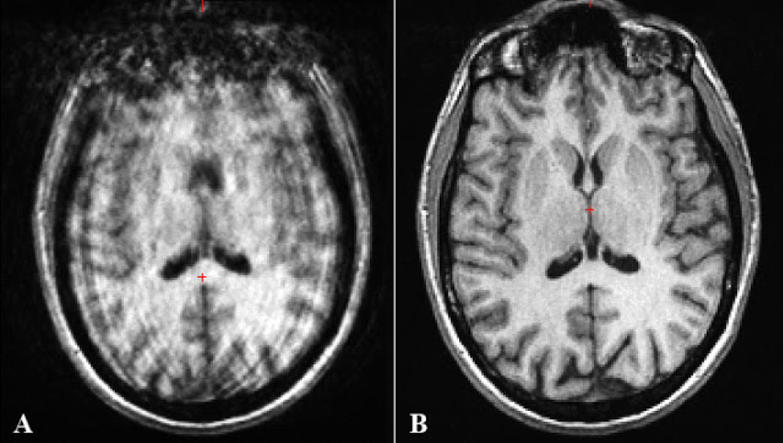

An example of a severe motion artifact (A) compared with a good image (B).

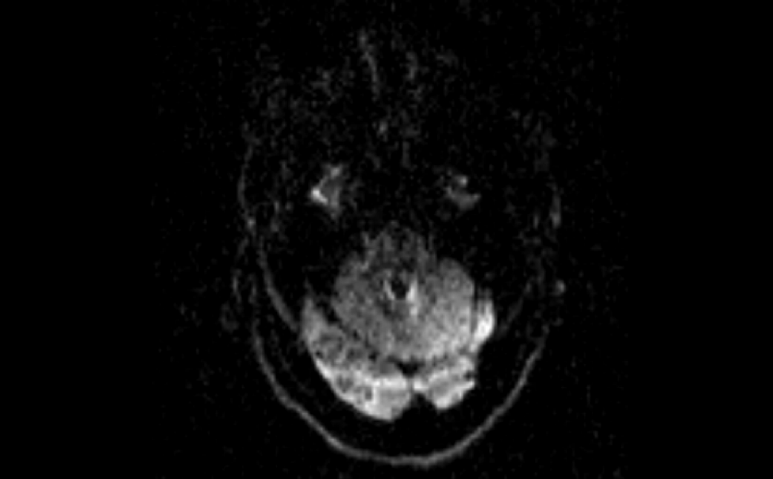

An example of ghosting where you can see the back of the skull is shown a second time in the middle of the brain.


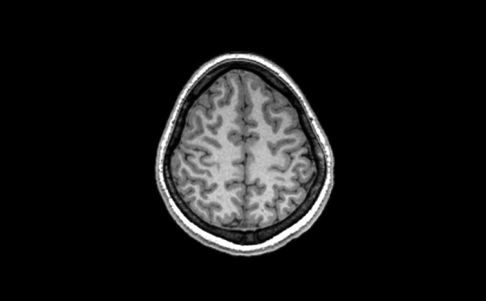

Example of ringing. If you look closely at the top of the image you will see ringing forming around the outside of the brain (which has been magnified below)

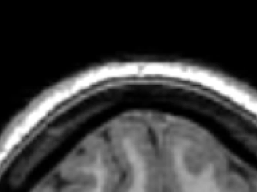


## Brain Masking and Mask QC

The next step in the pipeline involves making a "mask" for your structural data in order to define what is brain and what is not brain in the image. Structural masking is very important for other processing, especially for getting good Freesurfer output, and for accurate registration of brain images.

You will create brain masks for your data by using a training data set consisting of previously created and edited masks. We typically use T2 images (if you have acquired these) to make masks for both T2 and T1 images. There is a default training set that we use, however depending on your dataset you may need to create your own training data (e.g., if you are imaging children)

First, make sure you are in your `PipelineTraining` directory, then enter:
```
nifti_atlas -t derivatives/sub-sample/ses-1/anat/sub-sample_ses-1_desc-Xc_T2w.nii.gz -o derivatives/sub-sample/ses-1/anat/sub-sample_ses-1_desc-Xc_T2w -n 8 --train t2
```
This command will generate a mask for your T2 image, however it takes several hours to finish running.

* Because `nifti_atlas` takes so long to run, we have saved you the trouble of having to wait for the script to finish on your data. Instead, you can find an already generated sample T2 mask for your data in the `Other` directory in `PipelineTraining/sourcedata/sub-sample/ses-1`. The file is called `sub-sample_ses-1_desc-T2wXcMabs_mask.nii.gz`. (Note how **Mabs** was added to the `desc` signifier - this tells whoever is using this data after you that a Mabs script was used to generate this mask file. This is an example of how BIDS can be a convenient and descriptive convention for data sharing.)
* Now you can enter control+c into the terminal to stop the `nifti_atlas` script, and you can copy the mask file into your `derivatives/sub-sample/ses-1/anat` directory for use in further processing. Follow the same template as you did when you copied the sample files at the beginning of this tutorial, though you will not need the `-r` this time, since it is just one file.

* In addition to the brief overview of masking laid out below, there is also a manual dedicated just to masking that you can take a look at. It is a little outdated because it uses an older version of 3D Slicer, but the main part about how to edit structural masks effectively continues to be relevant. You should pay particular attention to the section "Initial Editing" through "Reviewing the Mask". You don't have to do it how the maker of the manual does it exactly, but she offers many helpful pieces of advice:

[Link to the Manual Here](https://drive.google.com/file/d/0B_CbEBeE5Vr0SEwyS0RNWlJLbWs/view?usp=sharing)

After you run `nifti_atlas`, you need to check the quality of your mask. Open **Slicer** by entering `/rfanfs/pnl-zorro/software/Slicer-4.8.1-linux-amd64/Slicer`.

Open `sub-sample_ses-1_desc-T2wXcMabs_mask.nii.gz` in **Slicer**, which should be in your derived `anat` directory.  Make sure that you select **Show Options** in the upper right corner and then scroll over and select the **Label Map** option. You will also need to open `sub-sample_ses-1_desc-Xc_T2w.nii.gz` (no need to select **Label Map** for this one).

you'll need to convert the mask to a segmentation. Go to the "Segmentations" module, and go to "Export/import models and labelmaps". Make sure "Import" and "Labelmap" are selected, and that your mask is the "Input node". Click **Import**.

Switch to the **"Segment Editor"** module. Click on the "sub-sample_ses-1_desc-T2wXcMabs_mask", and make sure the segmentation is "mask" and the master volume is "sub-sample_ses-1_desc-Xc_T2w". 

Because they use training data to make the masks, structural masks often do not need a lot or any editing. You should mainly edit large chunk of brain that are missing or large areas that are labeled that are not brain. Since it would be near impossible to be consistent, do not worry about editing single voxels around the edge of the brain. Sometimes this can be more harmful than beneficial, but on this example brain there are a few places that could use editing.

You now have a set of tools before you on the left portion of the screen that you can use to make sure that all of the brain and only brain is covered by the mask, although it is best to be over-inclusive as opposed to under inclusive. We've found it's best to start by selecting the **Margin** tool, which is the second one in the second row under **Effects**. Make sure "Grow" is selected and then choose **Apply** as this will make sure the edges are covered.

The tool that is mainly useful for editing the mask is the **Paint** tool, which is the second tool in the first row. Also feel free to experiment with the other tools to see if you can make good use of them  

* At this point your mouse will have a circle around it that shows the current size of your brush. There are a couple of things you should be aware of when using this tool to make your life easier:

  * Turn on **Toggle crosshair** which is the orange crosshair button above the red bar. With this on, whenever you are in one of the views and hit the **Shift** key, you will see what that location looks like on the other two slice views as well

  * If you hover over the tack icon at the top left corner of each view in the colored bar, another bar will drop down and on that you will want to select **Link/unlink the slice controls (except scales) across all Slice Viewers** as this will make it so that any changes made will happen in all views

  * If you then hover over the double chevrons next to the **Link/unlink** toggle, the menu will drop down further. Here you can lower the opacity of the mask by changing the number next to **sample-t2-mask**. I usually like **0.6**. 

  * you'll notice that next to the opacity control on the right is the **Toggle between showing label map volume with regions outlined or filled**. As it sounds like this toggles whether you see the whole mask or just the outline and this can sometimes be useful.

  * Two rows below the outline toggle is the **Interpolate background** toggle and it is often easiest to use the pixelated option, although both are useful in some situations.

  * There are also a number of things that can be done using the keyboard, but in order for these to work you have to click on of the viewing windows after you've selected the paint tool. 

    * Pressing the `g` key will toggle whether or not the mask is shown
    * Pressing the `3` key toggles whether your Eraser is on or not.  Which setting you are on is shown on the left by the colored bar under **PaintEffect**
    * Pressing the `1` key toggles whether you Paint Brush is on or not.
    * Pressing Shift and scrolling with the mouse scroll wheel will make the brush larger and smaller
    * Pressing the `z` key will undo the last edit you made, and the `y` key will redo the last edit you made.
    * Pressing the `+` and `-` keys will make the brush larger and smaller

When masking, make sure that you go through every slice on all three viewing windows. It is typical to start with the axial view (red) and go through at least twice.  For the inferior part of the brain, we don't begin the mast until you can see the cerebellum.  We don't include the eyes or optic nerves as brain, and there are a bunch of structures you will see that look like they might be brain but are not, but you will learn to recognize these as you go. Be sure to ask if you are unsure to start.  Make sure before you are done that there are no single-voxel islands. The final mask should look something like this:

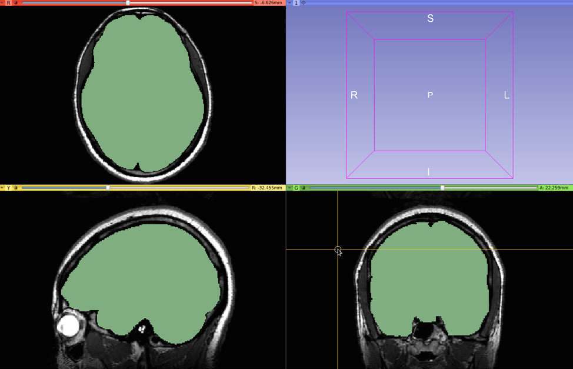

It might be useful for you to see a full example of a mask. Make sure you are in your PipelineTraining directory, and enter:
```
cp /rfanfs/pnl-zorro/software/pnlutil/trainingDataT2Masks/01063* ./
```

This will copy one of the T2 training masks and its corresponding raw file to your PipelineTraining directory. Enter `/rfanfs/pnl-zorro/software/Slicer-4.8.1-linux-amd64/Slicer`, and open these files (`01063-t2w-mask.nii.gz` and `01063-t2w.nii.gz`) from your PipelineTraining directory (**Ctrl+o** in **Slicer**). Remember to select **"Labelmap"** for the mask!

  * Scroll through the mask to get a sense of what is and isn't brain. It might take awhile to get comfortable, and that's okay! Remember, you can always ask questions and ask for help. These will always be in your PipelineTraining directory, so if you ever want to look back and refer to some sample masks while you're working on a project, feel free to do so.

To turn the mask back into a labelmap, go back to the **Segmentations** module. Go back to "Export/import models and labelmaps". Make sure "Export" and "Labelmap" are selected, and that your mask is the "Output node" Click **Advanced** and select the reference volume (the image that you are masking). For this example, the file will be `sub-sample_ses-1_desc-Xc_T2w.nii.gz`. Click **Export**. Make sure to save your mask with **Ctrl+s**, and make sure that you know the path of where you're saving it to (this should be `derivatives/sub-sample/ses-1/anat`). You only have to save the mask, so you can de-select the other files that show up in the **Save** window in Slicer. 

## FreeSurfer Segmentation and QC

Now that you have a good mask on your T2, you are going to apply that mask to your T1 image and generate an automated label map for white and gray matter parcellation. 

You will now need to complete an additional step so that the T2 mask you just made is aligned in the same way that the T1 is because you are about to register the T2 mask onto the T1 image. When you are in your derived `anat` directory, enter:
```
nifti_makeRigidMask -l sub-sample_ses-1_desc-T2wXcMabs_mask.nii.gz -i sub-sample_ses-1_desc-Xc_T2w.nii.gz -t sub-sample_ses-1_desc-Xc_T1w.nii.gz -o sub-sample_ses-1_desc-T2wXcMabsToT1wXc_mask.nii.gz
```

  * The `-l` flag is the labelmap that you're moving to another image.
  * The `-i` flag is the input T2 .nii.gz image
  * The `-t` flag is the target image for which you want the new mask.
  * The `-o` flag is the output mask that will be generated.
  
(Once again note the descriptive name of the T1 mask. Since this is registering a mask from a T2 onto the T1, the `desc` signifier reflects this)

There are a lot of settings that FreeSurfer has available for you to adjust what you want to do, but often times in this lab we use a standard set of settings which have been automated in a script called `nifti_fs`. While still in your derived `anat` directory, enter:
```
nifti_fs -i sub-sample_ses-1_desc-Xc_T1w.nii.gz -m sub-sample_ses-1_desc-T2wXcMabsToT1wXc_mask.nii.gz -o sample_freesurfer
```
This process will take about 12 hours to run to completion for each case.

  * `sample_freesurfer` can also be found in the `Other` directory as part of your `PipelineTraining/sourcedata` directory. Stop **FreeSurfer** from running by entering **Control+c** and you can copy this directory into your derived `anat`. Just remember to use the `-r` option here since there are many directories and files within this.

Once it has completed, you need to quality control your FreeSurfer labelmap. To start that you will need to start by opening it in Slicer. Enter:
`/rfanfs/pnl-zorro/software/Slicer-4.8.1/Slicer`to open slicer and then open it going to **File** > **Add Data** > **Choose File** to Add then go to your `sample_freesurfer` directory in strct and then go into `mri` and open `wmparc.mgz`. Before selecting the final **OK** make sure you select **Show Options** and then select **LabelMap**. Also open `brain.mgz`, which can be found in the `sample_freesurfer/mri` directory.

Now in order to actually see your label map transposed on the T1, you need to go to the **Modules** drop-down menu and select **Volumes**. First, make sure the Active Volume is `wmparc`. Then, under the **Volume Information** heading, make sure LabelMap is selected. Last, under the Display heading, for the **Lookup Table** dropdown box, go to **FreeSurfer** > **FreeSurferLabels**. You should end up with something that looks like this:

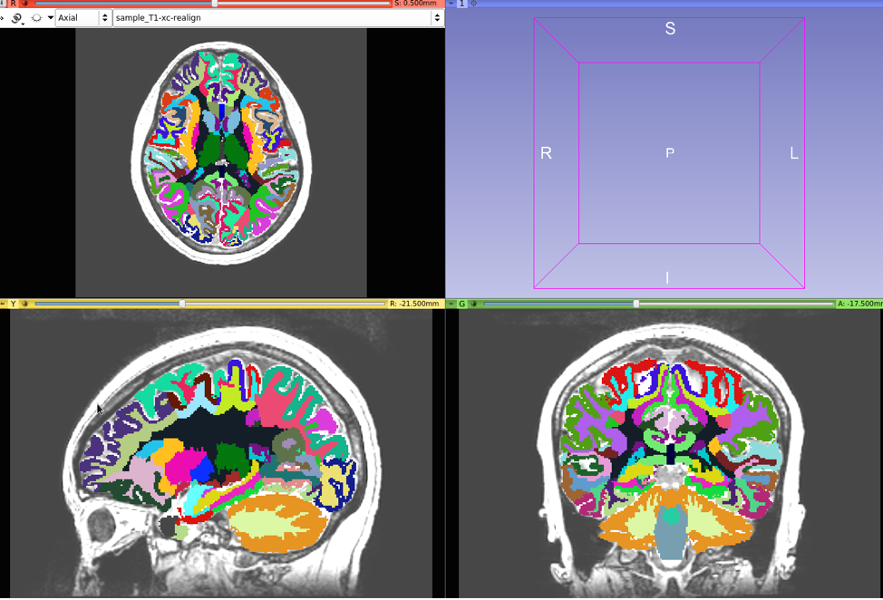

The first thing to look for that will be immediately obvious is whether the label map and the T1 image are aligned in the same way. The easiest way to do many of these checks is to reduce the opacity of the label map in the same way that you did with the masks you've made.

Next you will want to scroll through all of the slices of the brain and check if major portions of brain are missing anywhere. FreeSurfer does tend to be a little under inclusive with the cortical gray matter but that is considered okay. Here are a few examples of brains that were bad enough that they failed the check due to large missing chunks:

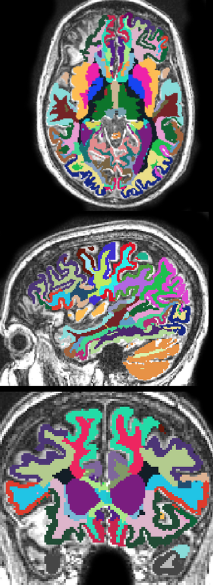
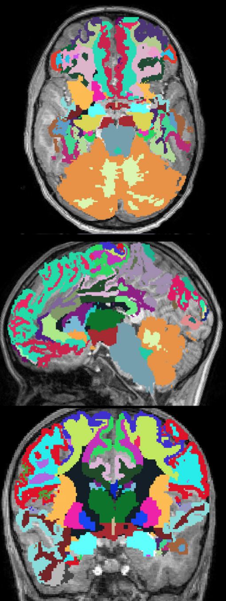


Two particularly common issues are missing temporal poles (below top) and inaccurate amygdala hippocampal complex (below bottom). Often times these issues will not cause the images to fail the check but they should be recorded. If these are areas that are of interest in the study you are working on, you will need to discuss with your PI how to address this. Below the areas that should be covered are outlined in red:

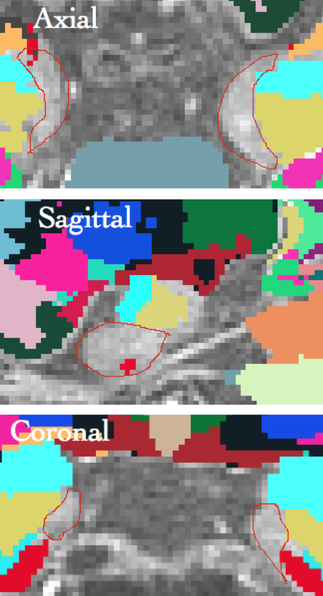

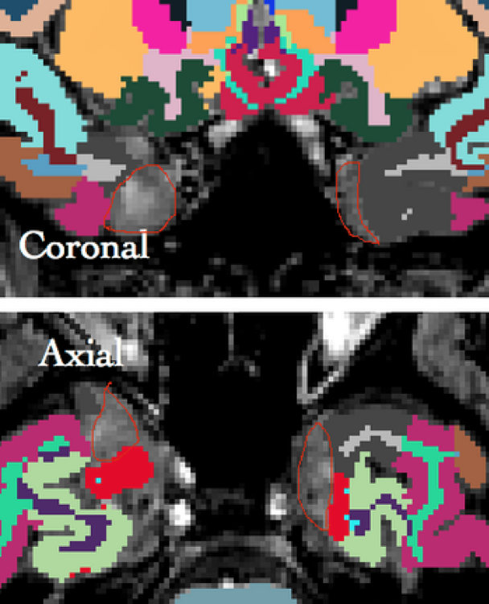


Some useful information can be gained just from looking at the FreeSurfer output. To look at it go into the `stats` directory in `sample_freesurfer` and look at the files `aseg.stats` and `wmparc.stats` using the command `cat`.


# The Pipeline - Diffusion

## Dicom to Nifti File Conversion

We once again have to convert the raw Dicoms to a Nifti image, this time for the diffusion files. Because we will now be working with diffusion MRI data instead of structural MRI data, we need to make a separate directory in `rawdata` for the resulting images. 

In your `PipelineTraining` directory, enter:
```
mkdir rawdata/sub-sample/ses-1/dwi
```
To convert the Dicoms, enter:
```
dcm2niix -b y -z y -f sub-sample_ses-1_dwi -o rawdata/sub-sample/ses-1/dwi sourcedata/sub-sample/ses-1/Diffusion_b3000
```

After a bit of a wait and some output messages printed on your screen,  and you should now have a file called `sub-sample_ses-1_dwi.nii.gz` in your raw `dwi` directory (along with `sub-sample_ses-1_dwi.bval`, `sub-sample_ses-1_dwi.bvec`, and `sub-sample_ses-1_dwi.json`), which you can see by entering `ls`.

A `.bval` file is a text file where the B-value for every gradient is listed in order separated by a space. A `.bvec` file is a text file with the x,y,z vectors of each gradient listed in order separated by a space between directions and a return between gradients. This is additional information that supplements your `.nii.gz` diffusion file, so make sure to keep all three files together. 

## Axis Aligning and Centering

Now that we're moving on to making derived files, we have to make a `dwi` directory in `derivatives`, which is where all the outputs will be saved from here forward. 

Type:
```
mkdir derivatives/sub-sample/ses-1/dwi
```

Similarly to how you axis-aligned and centered your structural images, we'll do the same for our diffusion images. Make sure you're in your `PipelineTraining` directory and type:
```
nifti_align --axisAlign --center -i rawdata/sub-sample/ses-1/dwi/sub-sample_ses-1_dwi.nii.gz --bvals rawdata/sub-sample/ses-1/dwi/sub-sample_ses-1_dwi.bval --bvecs rawdata/sub-sample/ses-1/dwi/sub-sample_ses-1_dwi.bvec -o derivatives/sub-sample/ses-1/dwi/sub-sample_ses-1_desc-Xc_dwi 
```
To check that the command worked properly, you can `ls` in your derived `dwi` directory where you should see `sub-sample_ses-1_desc-Xc_dwi.nii.gz` as well as `sub-sample_ses-1_desc-Xc_dwi.bval` and `sub-sample_ses-1_desc-Xc_dwi.bvec`.
As with the structural data, we can now compress the Dicom directory for the diffusion files to conserve space. In `PipelineTraining` enter:
```
tar -czvf sourcedata/Diffusion_b3000.tar.gz sourcedata/sub-sample/ses-1/Diffusion_b3000
```
Because taring as above creates a compressed file, but doesn't remove the source data, you're not actually saving space until you've removed the data you've just compressed. Once you're certain that the `.tar.gz` was properly created, you can type the following in order to remove the raw data:
```
rm -r sourcedata/sub-sample/ses-1/Diffusion_b3000
```

**Note:** REMOVING FILES USING RM IS A PERMANENT ACTION AND IF YOU REMOVE FILES THAT YOU NEED, THEY ARE **GONE**. Because of this be very careful when you remove files and only remove files that you are 100% sure you and nobody else will ever need again. If you don't know what it is, do not remove it. Also, as a good rule of thumb it is best to never remove files that you did not make because you never know what they could be being used for. Basically, the only files we ever remove are ones that are redundant, such as in the example above.


## Quality Control (Parameter, Visual, and Auto)

You will first need to do a parameter check where you are essentially making sure all of the headers look like they should and that all the cases match each other. Whether or not each case passes the different QC checks should be recorded in an **Excel** spreadsheet on **LabArchives** or on **Dropbox**. There are several fields you will need to look at but first to see the header, make sure you are still in the directory with your new `.nii.gz` files and enter:
```
fslhd sub-sample_ses-1_desc-Xc_dwi.nii.gz
```
Bear in mind that, unless otherwise specified, the value for each field listed is the value that you should see in this example, but it may vary depending on your project.

* First, the `sform_{x,y,z}` parameters should read `Right-to-Left`, `Posterior-to-Anterior`, and `Inferior-to-Superior`. (If it does not, it will likely read `right-anterior-superior`). Talk to someone about if you need to change this. The space should be consistent in all cases.

* Next, `dim 1`, `dim 2`, `dim 3`, and `dim 4` (image sizes) should always be the same between all cases in your dataset.  Any case with incorrect sizes automatically fails and can no longer be used for further processing. In this sample case `dim 1`, `dim 2`, `dim 3`, and `dim 4` should read `128 128 70 74`.

* `sto_xy{1,2,3,4}` (space directions and space origins) should be the same between cases. Small deviations in space directions between cases are okay (e.g. .98877350 instead of 1), but a large difference (e.g. 2 instead of 1) is a problem, as is a difference in sign (e.g. -1 instead of 1). Depending on the situation, the space directions of an image may be corrected via upsampling or downsampling the image. Talk to an RA or your PI about this possibility if you encounter it. In this example it should read (-2, 0, 0, 127.5) (0, 2, 0, -127.5) (0, 0, 2, -69) (0, 0, 0, 1). If a case has a different space origin, it may mean that this case was not axis aligned and centered.

* If you type `cat sub-sample_ses-1_desc-Xc_dwi.bval`, you can see the b-values from all the gradients. The highest should be consistent across all cases, and should be a reasonable value (usually, these tend to be between 2000-3000).

* If you type `cat sub-sample_ses-1_desc-Xc_dwi.bvec`, you can see the vectors from each gradient. There should be 73 lines and the three numbers (x,y,z vectors) for each gradient should roughly match between cases.  If either there are not all of the gradients or the numbers don't match in a case, the case is failed.

* Many of these fields can also be compared between all cases at once using a for loop.

The other half of the QC is the visual and automatic check where you look at the images on FSLEyes.

To open FSLEyes, type `fsleyes &`.

To open your sample file go to **File** > **Add from File** > and then open `sub-sample_ses-1_desc-Xc_dwi.nii.gz` in the `/rfanfs/pnl-zorro/home/yourdirectory/PipelineTraining/derivatives/sub-sample/ses-1/dwi` directory.

You can scroll through each view by clicking and dragging in the window with the left mouse button. The sliders at the top next to brightness and contrast will allow you to adjust how the picture looks. To scroll through the gradient directions, there will be a box labeled **Volume** near the bottom of the screen. You can use your scroll wheel while hovering over this box, click on the up and down arrows, or type in a desired number to go through each gradient. You will probably have to adjust the brightness/contrast for some of these. Have an RA go through a QC tutorial with you to learn more about QCing diffusion scan.

For now, you will want to look through all 73 gradients for a few different things: **movement artifacts**, **ghosting**, and **signal drops**.  In your spreadsheet from the parameter checks, note any movement artifacts and ghostings along with which gradients show signal drops. To change gradients, scroll over the **Volumes** counter.  Then, look for **DWI Component** on the left under **Display** > **Scalar Display** and you can move through them with the arrows. Look below to see an example of each:


An example of a severe motion artifact (A) compared with a good image (B).


An example of ghosting where you can see the back of the skull is shown a second time in the middle of the brain.

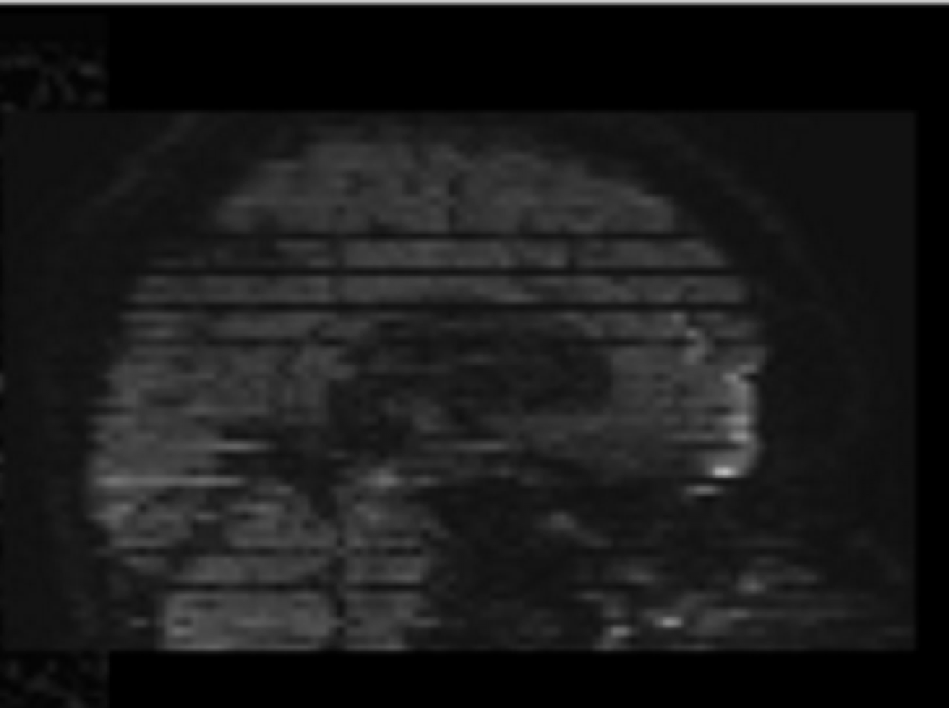

An example of a signal drop.

Before turning now to an automated QC tool, check with your PI about how severe these different things need to be to disqualify a case and in the case of dropped signal, check also if you will be getting rid of gradients within a case that have dropped signal or if you will keep them.

## Motion and Eddy Current Correction

Now that you ideally have only the cases and gradients that are usable for further processing (which we'll say is all of them in this example), you can correct for motion and eddy currents. Make sure you are still in your derived `dwi` directory and enter:
```
pnl_eddy --bvals sub-sample_ses-1_desc-Xc_dwi.bval --bvecs sub-sample_ses-1_desc-Xc_dwi.bvec -i sub-sample_ses-1_desc-Xc_dwi.nii.gz -o sub-sample_ses-1_desc-XcEd_dwi
```
Running this to completion could take some time (about 30 minutes) and you will see it progress through each gradient. After it is done you will have a file called `sub-sample_ses-1_desc-XcEd_dwi.nii.gz` in the directory as well.

Since this takes a long time, it is also available to be copied from the `Other` directory in `sourcedata/sub-sample/ses-1/` into your derived `dwi` directory. You will also need to copy `sub-sample_ses-1_desc-XcEd_dwi.bval` and `sub-sample_ses-1_desc-XcEd_dwi.bvec` along with `sub-sample_ses-1_desc-XcEd_dwi.nii.gz`.

## Tensor Mask

To mask a diffusion image, follow the instructions [here](https://confluence.partners.org/pages/viewpage.action?spaceKey=PNL&title=Segment+Editor+Diffusion+Masking) to mask `sub-sample_ses-1_desc-XcEd_dwi.nii.gz` (in the derived `dwi` directory). Be sure to save the output mask into your derived `dwi` directory as `sub-sample_ses-1_desc-dwiXc_mask.nii.gz`. **Note: The structural mask we copied over earlier had a more specific descriptor, specifying it as a mask that was created using Mabs. Since you created this mask manually, there would be no such signifier. 

## EPI Distortion Correction

To further correct for distortions caused by magnet interactions and magnetic inhomogeneity (which leads to intensity loss and voxel shifts), you will now have to run an EPI correction. This is done by co-registering it with the T2 image, which means that you need to have T2 images for the case to do this step and also that you will need to have masked the T2 file (step 5 of the structural pipeline) so that you can use it for this. If T2 images were not taken for the particular case (they were for this example) then you will have to skip this step. 

In order to run EPI correction, you will need to make sure that you have bval and bvec files whose names match your dwi file. In this case, the prefix will be `sub-sample_ses-1_desc-XcEd_dwi`. You should already have copied these when you copied your files after eddy correction.

Now you can be in `PipelineTraining/derivatives/sub-sample/ses-1`. Enter:
```
pnl_epi --dwi dwi/sub-sample_ses-1_desc-XcEd_dwi.nii.gz --dwimask dwi/sub-sample_ses-1_desc-dwiXc_mask.nii.gz--t2 anat/sub-sample_ses-1_desc-Xc_T2w.nii.gz --t2mask anat/sub-sample_ses-1_desc-T2wXcMabs_mask.nii.gz -o dwi/sub-sample_ses-1_desc-XcEdEp_dwi
```

* Since this takes a long time, `sub-sample_ses-1_desc-XcEdEp_dwi.nii.gz`, and corresponding `bvec` and `bval` files, is also available to be copied from the `Other` directory into your `Diffusion_b3000` directory.

* If this is the first case that you are doing in a data set, and for this tutorial we can pretend that it is, you should check the glyphs of the case's DTI because sometimes they are incorrect, which will lead to the tractography being incorrect as well.

* Even if you know little about how the glyphs should look there is an easy trick that is generally good enough when making this determination. This involves looking at the corpus callosum, which is the most major white matter bundle connecting the two hemispheres.

* Since we will be using Slicer for this QC, we will need to convert our data to NHDR format. First, `cd` into your derived `dwi`. Then enter the following to convert the epi-corrected image to NHDR format:

```
nhdr_write.py --nifti sub-sample_ses-1_desc-XcEdEp_dwi.nii.gz --bval sub-sample_ses-1_desc-XcEdEp_dwi.bval --bvec sub-sample_ses-1_desc-XcEdEp_dwi.bvec --nhdr sub-sample_ses-1_desc-XcEdEp_dwi.nhdr
```
We will also need to convert the mask to NHDR format with the following:

```
nhdr_write.py --nifti sub-sample_ses-1_desc-dwiXc_mask.nii.gz --nhdr sub-sample_ses-1_desc-dwiXc_mask.nhdr
```


* Open Slicer using `/rfanfs/pnl-zorro/software/pnlpipe3/Slicer-4.8.4-linux-amd64/Slicer` and open `sub-sample_ses-1_desc-XcEdEp_dwi.nhdr`. The first thing you need to do is generate a DTI (Diffusion Tensor Image). This will show the orientation of the fibers in each voxel using color coding (red is left to right, blue is up and down, and green is forward to backward). Under Modules, go to **Diffusion** > **Process** > **Diffusion Tensor Estimation**.

  * For **Input DWI Volume**, select **sub-sample_ses-1_desc-XcEdEp_dwi**.
  * For **Output DTI Volume**, you can create a new volume as **sub-sample_ses-1_desc-XcEdEp_dti.nhdr**.
  * For **Output Baseline Volume** you can create a new volume as **sub-sample_ses-1_desc-dwiXcEdEp_bse**.
  * Select **Apply**.

* Going to the drop-down pin in the top left corner of a viewing window and the the double chevrons under that, you will have to change the bottom right box from the baseline to **sub-sample_ses-1_desc-XcEdEp_dti**. Select the rings next to the chevrons to do this for all views.  You will get an image that looks like this:

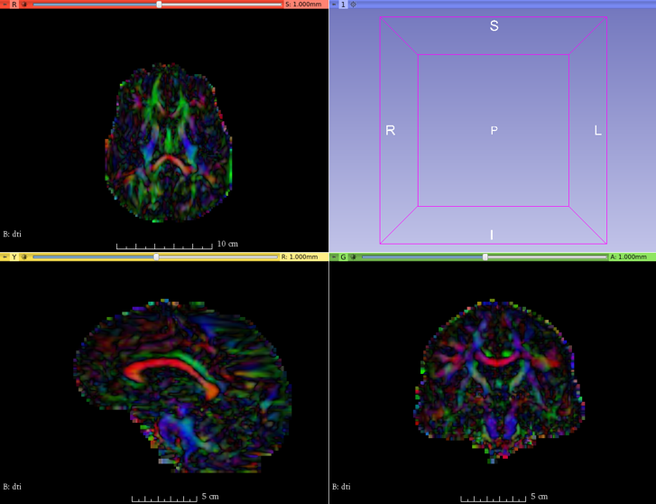

* Looking at the coronal view (green) scroll to a slice that has a red "U" shape in the upper middle part of the brain. There are a lot of them, but any will do. This structure is the corpus callosum and it looks like this:

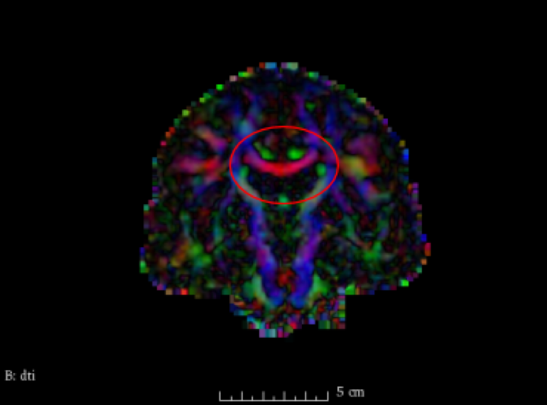


* Then go to the **Volumes** module and make sure that the **Active Volume** is **sub-sample_ses-1_desc-XcEdEp_dti**.

* Scroll down on the sidebar to the **Glyphs on Slices Display** and choose **Green** for **Slice Visibility**. Then for **Glyph Type** choose **Lines** as this will allow Slicer to run faster.

* You should now see this on your screen:

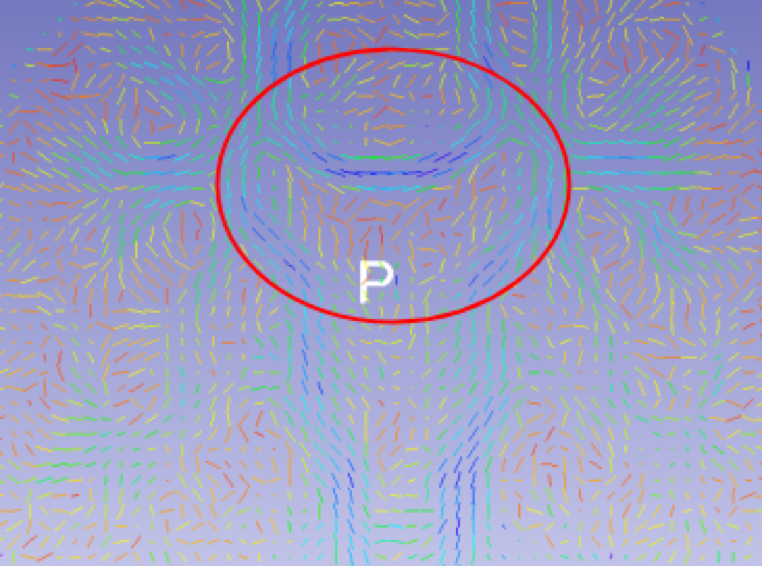

* The area where the corpus callosum was will probably have turned to dark blue, but if it is correct the lines will follow the "U" shape to make a somewhat smooth curve. If it is incorrect, the lines will not follow the "U" shape, but instead might just all be horizontal or even form more of an "N" shape. This can be seen here:

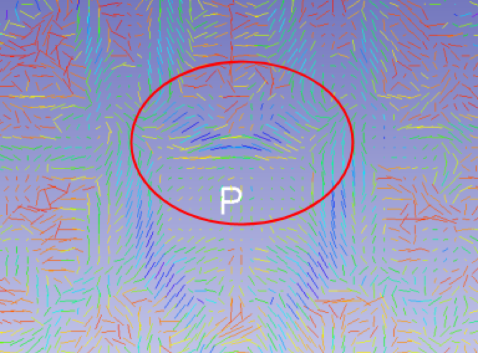
	  
* You will also need to check the corpus callosum in the other two views (red and yellow). To do this you simply uncheck **Green** for slice visibility and select the color you want.

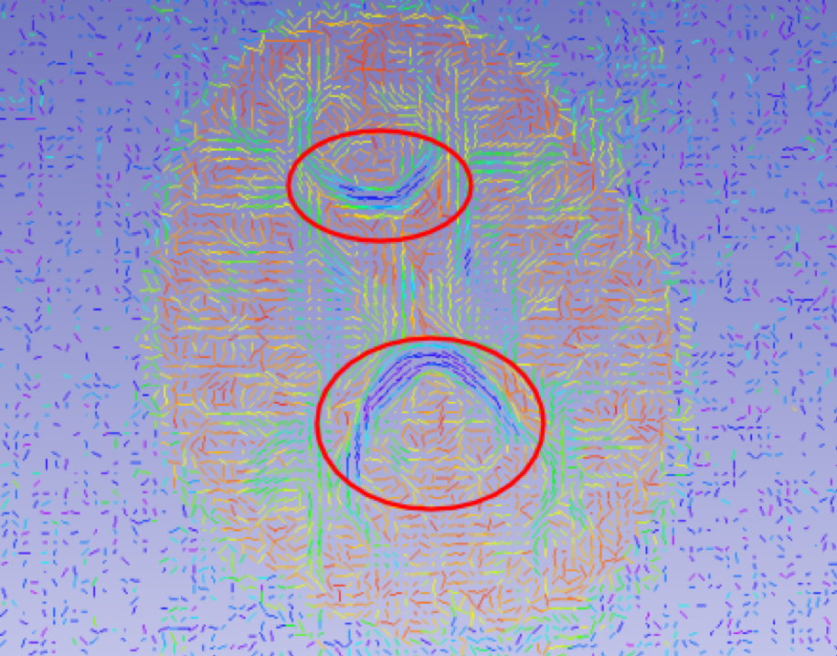

* This is how the corpus callosum should look in the in the axial view (red) if you are looking at the middle slice or thereabouts. The upper portion should be arranged like a "U" while the lower portion should be arranged like an "N". Make sure you look at both parts of the corpus callosum because it is possible for one to be correct while the other is not:

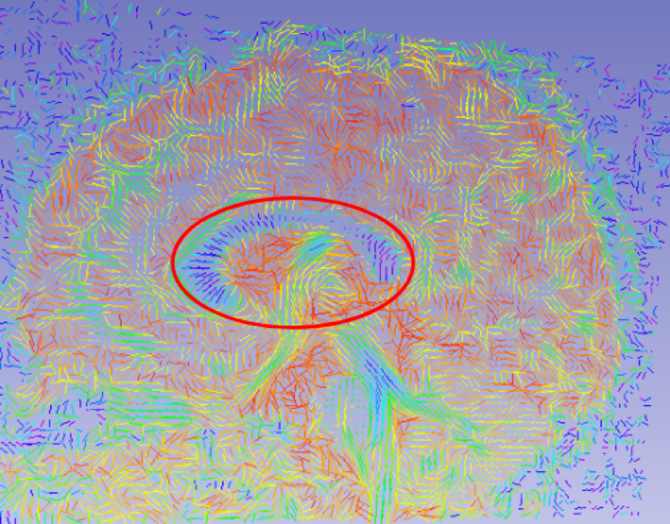
* This is how the corpus callosum should look in the sagittal view (yellow) if you are looking at around the middle slice. The glyphs should look like they are more or less arranged straight in and out parallel with your view:

* They should all look correct in this sample case, but if it doesn't look correct, you can fix it by changing the header of the epi-corrected file. To do that, back in the terminal, enter `gedit sub-sample_ses-1_desc-XcEdEp_dwi.nii.gz`. The header will come up in a text editor. You are interested in the **measurement frame**. The first thing you can try is changing any non-zero numbers in the first set of coordinates to negative. Then save and load the epi-corrected image in Slicer again and do the whole process over again.

If this time the glyphs look correct in the corpus callosum, you have fixed it for that case. If they still don't look correct, change the first set of coordinates back to positive and make the second set negative. There are 7 possible permutations of negatives that you can try if necessary. It is usually the case that the proper measurement frame is the same for every case in a dataset, but this is not always the case, especially if the data was acquired on more than one scanner or over a long period of time. Because of that, before you then make this change to the header of every epi-corrected dwi for every case in the dataset, you should check this on a handful of other cases as well. 


## Two-Tensor Whole Brain Tractography

It is now time to generate a tractography image, which creates images that look like this:


We will be using UKF Tractography to generate this image. In the derived `dwi` directory, make a new directory called `Tractography/`

UKF Tractography works best for b-values where **700 <= b <= 3000**. These can be found in the `sub-sample_ses-1_desc-XcEdEp_dwi.bval` file, which you can see with `cat sub-sample_ses-1_desc-XcEdEp_dwi.bval`. Make sure you check with your PI that UKF Tractography will work well for your dataset. Our b-value is acceptable for the current example. When you are in the derived `dwi` directory, enter:
```
ukf -i sub-sample_ses-1_desc-XcEdEp_dwi.nii.gz --bvals sub-sample_ses-1_desc-XcEdEp_dwi.bval --bvecs sub-sample_ses-1_desc-XcEdEp_dwi.bvec  -m sub-sample_ses-1_desc-dwiXc_mask.nii.gz -o Tractography/sub-sample_ses-1_desc-XcEdEp_tracts.vtk --params --numThreads,8,--recordTensors
```
Be warned that depending on the computing power you are using this process could take anywhere from a few hours to several days.

Since this takes quite a long time, `sub-sample_ses-1_desc-XcEdEp_tracts.vtk` is also available to be copied from the `sourcedata/sub-sample/ses-1/Other` directory. 

The value for  `--numThreads` most often is `8` and this is the computing power you are using for the process in terms of number of cores being used. For other projects, you will want to ask someone how many cores you should be using.

You may also want to specify `--seedsPerVoxel`. Typically, we use `--seedsPerVoxel 10`, which means we will have 10 seed points in each voxel.  If unspecified it will use the default of 1. A higher number will cause it to generate more fibers, but it will also take up more time and space. Ask your PI if you should use a different value.

Other options that can be manipulated (depending on your B-value and the number of fibers being generated) include `--minGA --minFA --seedFALimit`. 

If you want to extract free water measures from your data, make sure to also include the flags ``--freeWater --recordFreeWater``.

Once it is finished running, you can open it in Slicer if you would like to see what it looks like when it is done. You will need to open `sub-sample_ses-1_desc-XcEdEp_tracts.vtk` in your `Tractography` directory. Be sure that before you hit **OK**, you change the **Description** to **FiberBundle** after checking the box next to **Show Options**.

When it opens you will notice that the whole thing is most likely pink, like this:

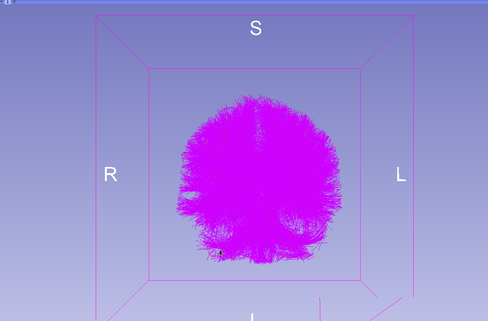
	
There are more interesting color schemes, however, that will tell you different information about the image. You can change between these by going to the **Modules** drop down and selecting **Diffusion** > **Tractography Display**. Under the **Advanced Display** heading you can play around with the different options to look at different things. 

## Finishing the Pipeline

To continue on from this point you will need to have both the diffusion and the structural steps completed, since these use both of them. 

## FreeSurfer Labelmap to DWI-Space Registration

The first step of post-processing involves registering the FreeSurfer labelmap that you made to the diffusion image since they don't have the same resolution and aren't in the same space. First, make sure you are in the `PipelineTraining/derivatives/sub-sample/ses-1` directory and enter:
```
nifti_fs2dwi --dwi dwi/sub-sample_ses-1_desc-XcEdEp_dwi.nii.gz --dwimask dwi/sub-sample_ses-1_desc-dwiXc_mask.nii.gz -f anat/sample_freesurfer -o anat/sample_fs2dwi witht2 --t2 anat/sub-sample_ses-1_desc-Xc_T2w.nii.gzz --t2mask anat/sub-sample_ses-1_desc-T2wXcMabs_mask.nii.gz
```
It will take about 6 hours to run to completion, so type **Ctrl+c**.

Since this takes a long time this is also available to be copied from the `Other` directory. Just be sure use the `-r` option since `sample_fs2dwi` contains lots of directories and files.

Note: If you do not have T2s as part of the case you are working with you will have to use a different version of this command, which will not lead to suboptimal but fine results. Its format is:
```
nifti_fs2dwi --dwi <dwi_Ed> --dwimask <tensor_mask> -f <freesurfer_directory> -o <output_directory> direct
```

Once the script has finished running, you will find that there is a file called `wmparcInDwi.nii.gz` in the `sample_fs2dwi` directory. Open this file along with `sub-sample_ses-1_desc-XcEdEp_dwi.nii.gz` in Slicer to see if they are registered well. Make sure that `wmparcInDwi.nii.gz` is checked for Label Map.

When it opens, it will probably not appear as it should, and to fix this go to the **Volumes** module and for the **Active Volume** select `wmparcInDwi`. Then, under the **Display** heading, change Lookup Table to **FreeSurfer** > **FreeSurferLabels**. You should open up `b0masked.nii.gz` as well (as a normal Volume). It will look something like this:

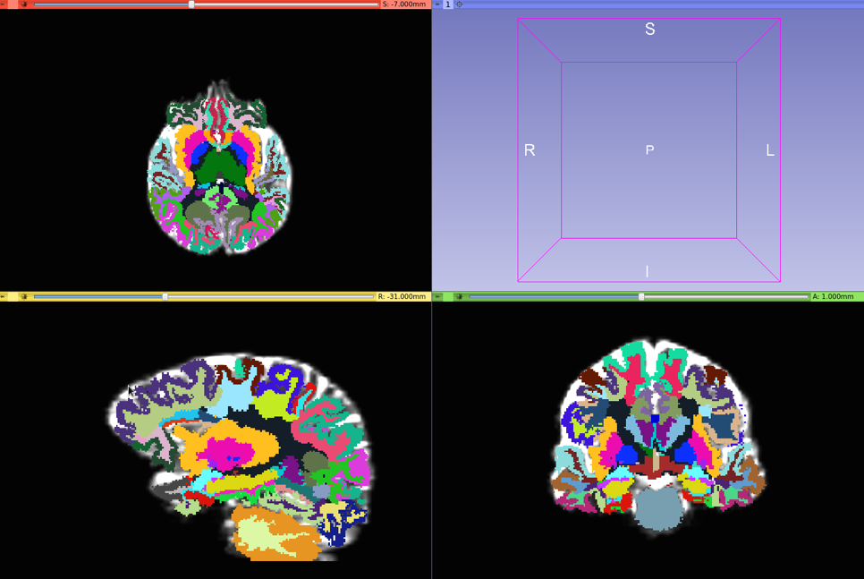

To check if the registration is good you scroll through the different views similar to how you did when quality checking the FreeSurfer labelmap during step 6 of the structural portion of the pipeline. 

# White Matter Analysis

This step is not a part of the figure on the first page of this tutorial, but it is often a good idea to complete this extra form of quality control.

Go into the derived `dwi` directory and enter:
```
wm_quality_control_tractography Tractography/ tractQC/
```

Next, go into your new `tractQC` directory. To do a visual QC, enter `gio open view_<area>.html`. There are 6 different areas that you can look at (**ant**, **inf**, **left**, **post**, **right**, and **sup**) and you should inspect each of them carefully.

* One paper that is very helpful in determining what to look for is "A diffusion tensor imaging tractography atlas for virtual in vivo dissections" (Catani & Thiebaut de Schotten, 2008) so give it a look.

Then to do a data QC, make sure you are still in the `tractQC` directory and enter:
```
oocalc quality_control_fibers.txt
```
A window will pop up and you can just select **OK**.

A spread sheet will then open up and in the example it will only contain one row, but normally each case will have a row. You would be mainly interested in the **TOTAL_FIBERS** and **LEN_200** columns, which count the number of total tracts and the number of the longest type of tract respectively. We are looking to see if any case has an abnormally low level of either of these values relative to the rest of the cases. The easiest way to do
this would be to sort the columns and look at the lowest ones using the **Sort Ascending** or **Sort Descending** tool in the upper toolbar. 

Talk with your PI in the case where any case fails any of the QCs.

## White Matter Query Language

At this time you will use white matter query language to put the FreeSurfer output in the same space as the tractography by using Demian's method to automatically select fibers connecting specific regions from the whole brain tractography.

Something that would be good to do before you actually run the script is to have a look at the query files that you will have to use to reference the area you are interested in looking at. To do this go to `/projects/schiz/software/LabPython/tract_querier/queries`. Once here, enter:
```
gedit FreeSurfer.qry
```
and a window should pop up. Don't change anything in this window but you'll notice that it contains the names of all of the different brain regions followed by the number code given to them in the FreeSurfer output. When looking at a FreeSurfer labelmap, when you put your mouse over a color-coded brain region this is the number that pops up in the bottom left hand corner of the screen along with the brain region abbreviation.  If you exit out of this you can also enter:
```
gedit freesurfer_queries_new.qry
```
and this defines individual tracts.
 
Now go back to your `PipelineTraining/derivatives/sub-sample/ses-1/` directory and enter:

```
nifti_wmql -f anat/sample_fs2dwi/wmparcInDwi.nii.gz -i dwi/Tractography/sub-sample_ses-1_desc-XcEdEp_tracts.vtk  -q /rfanfs/pnl-zorro/software/pnlutil/pipeline/wmql-2.0.qry -o dwi/wmql
```

After it has finished running, you can go into the `wmql/` directory and see that it has generated files for all kinds of tracts.

You would now use these files to QC whichever areas you are interested in the study, so for this example we can choose a random one, say `af.left.vtk`, to have a look at.  Open the file in Slicer making sure to choose **FiberBundle** option for **Description** and also open `wmparc.mgz`  in the `anat/sample_freesurfer/mri` directory with **Volume** selected.

When it is open go to **Volumes** in **Modules** and under the **Display** header, change the **Lookup Table** value to **FreeSurferLabels**. At this point you should have something like this:

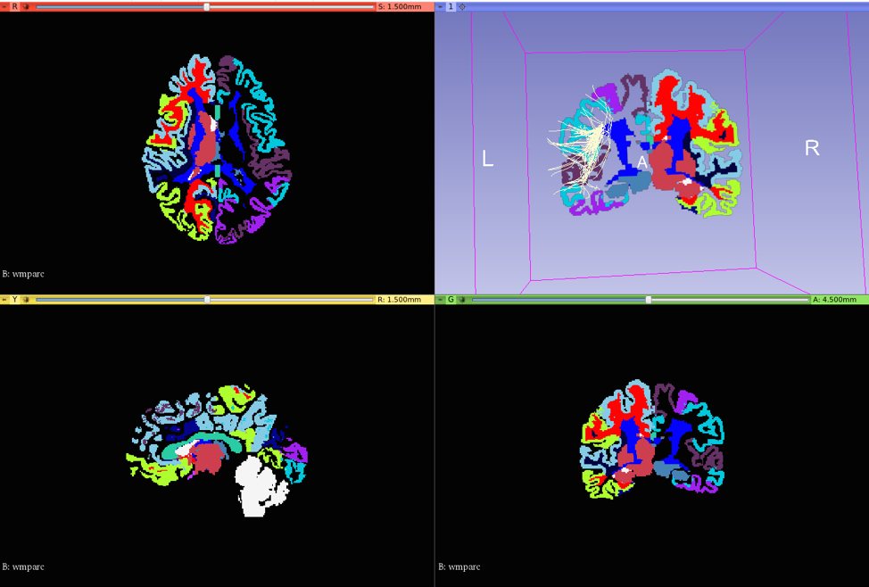
 
The region you are looking at with the tracts is the left arcuate fasciculus. When doing the QC the main things you want to look for are that the tracts intersect the regions they are supposed to on the label map and that they have the shape they should. A good source of this information is the Catani & Thiebaut de Schotten paper mentioned above. The region you are looking at is supposed to connect the perisylvian cortex of the frontal and temporal lobes and the example seen here does seem to do that, although as I mentioned before they should be a little off in the example.

To QC individual tracts from WMQL, you first need to make sure that all of the .vtk files for that tract are in the same directory. If they are not all in the same directory to start, one way that you can do that without moving or copying all of the .vtk files is to make softlinks for them all, which is basically just a file that when accessed will redirect to the actual file. 

To do this you use the format:
```
ln -s <full path to actual file> <full path to softlink directory>
```
Once you have done this, use the following format:
```
wmqlqc -i <input WMQL directory> -o <output WMQL directory> -s <case ID>
```
In our case, we will be QCing all the tracts of an individual subject. Make sure you are in the `PipelineTraining/derivatives/sub-sample/ses-1` directory and enter the following:
```
wmqlqc -i dwi/wmql -o dwi/wmqlqc -s sample
```

## Extract Measures

For the final step of the pipeline you need to now extract all of the measures you want from the images. There are two ways to do this:

* Way 1: Go into your `wmql/` directory. Enter:
```
/rfanfs/pnl-zorro/software/pnlpipe3/pnlpipe/pnlscripts/measuretracts/measureTracts.py -i *.vtk -o sample-summarizetracts.csv
```

  * You can open this file by entering:
	```
	oocalc sample-summarizetracts.csv
	```
You will see that the organization of this spreadsheet mirrors the organization of your directories, i.e. a summary spreadsheet per subject, with all of the tracts for that subject in the spreadsheet. If you would like to flip this, and have a summary spreadsheet per tract, then you would need to have make a directory per tract, as referenced above. 

* Way 2: In **Slicer**, you can go to the **Modules** drop-down and go to **Diffusion** > **Quantify** > **Tractography** > **Tractography Measurements**

  * Now you will need to create a blank text file for the program to put the information into. You can do this by entering in terminal `touch sample-af.txt`.

  * Under the **IO** header, for **Select Input Type**, choose **Fibers_File_Folder**. For **Fibers File Folder** select your wmql directory and for **Output Text File** you can select the text file you just made. Then for Select Output Format choose **Column_Hierarchy** and for **Output Field Separator** choose **Tab** and press **Apply**.

  * Now you can see the text file by entering `oocalc sample-af.left.txt`.

You may notice that there are some differences in what these two methods give you, so which you choose largely depends on what you're looking for, and sometimes it may be necessary to use boths ways to get everything you need:

Way 1 will give you FA, AD, RD, and Trace among other less commonly used diffusion measures. It will give you not only the mean of these values for the case, but also the minimum and maximum values. Be careful to mind that the values it gives you are 1000 times the values you will typically see, including what you get using Way 2. This is alright but something you need to keep in mind during analyses. Way 1 will not give you FW or associated measures like FAt and so on.

Way 2 will not give you AD and RD, but it will give you FW and other measures associated with that if you record them during tractography, which Way 1 will not. Further, for FA, it will give you the measure for both tensors (since we are running two tensor tractography), as opposed to just the first tensor with Way 1. This way only gives you the mean, however, and not the min and max values. Last , this method rounds 6 digits earlier than Way 1 does.

You would normally compare different measures between cases much like you did before to see if there are any extremely low values that are possibly incorrect but obviously that is not possible with only 1 case in this example. Generally, any outliers in any field should be noted.

At this point you are ready to go into any statistical analysis that the project may require.

Congratulations! You have made it through the tutorial!! You should now tar/zip your PipelineTraining to save space. You can do that with the following command:
```
tar -zcvf /rfanfs/pnl-zorro/home/<yourdirectory>/PipelineTraining.tar.gz /rfanfs/pnl-zorro/home/<yourdirectory>/PipelineTraining
```

# Summary of Commands
Setup your environment
```
source /rfanfs/pnl-zorro/software/pnlpipe3/bashrc3
```
Go to your pipeline folder
```
cd $folder
```

## Structural Pipeline
Data conversion
```
dcm2niix -o . -f t1 -z y /rfanfs/pnl-zorro/Tutorial/Case01183_NiPype/raw/T1
```
```
dcm2niix -o . -f t2 -z y /rfanfs/pnl-zorro/Tutorial/Case01183_NiPype/raw/T2
```
Axis Alignment and Centering
```
nifti_align -i t1.nii.gz --axisAlign --center -o t1-xc
```
```
nifti_align -i t2.nii.gz --axisAlign --center -o t2-xc
```
Brain Masking via multiatlas labeling
* *(Use /rfanfs/pnl-zorro/software/pnlpipe3/pnlpipe/soft_dir/trainingDataT1AHCC-8141805/trainingDataT1Masks-hdr.csv if no T2's)*
```
nifti_atlas csv -t t2-xc.nii.gz -o t2-xc -n 8 /rfanfs/pnl-zorro/software/pnlpipe3/pnlpipe/soft_dir/trainingDataT2Masks-12a14d9/trainingDataT2Masks-hdr.csv
```
Align T2 mask to T1 image
```
nifti_makeRigidMask -i t2-xc.nii.gz -l t2-xc-mask.nii.gz -t t1-xc.nii.gz -o t1-xc-mask.nii.gz
```
Run FreeSurfer
```
nifti_fs -i t1-xc.nii.gz -m t1-xc-mask.nii.gz -n 8 -o FreeSurfer
```

## Diffusion Pipeline
Data conversion
```
dcm2niix -o . -f dwi -z y /home/hpc/pn72sa/ru48vil/Tutorial/Case01183_NiPype/raw/Diffusion_b3000/
```
Axis Alignment and centering
```
nifti_align -i dwi.nii.gz --bvals dwi.bval --bvecs dwi.bvec --axisAlign --center -o dwi-xc
```
Eddy current correction
```
pnl_eddy -i dwi-xc.nii.gz --bvals dwi-xc.bval --bvecs dwi-xc.bvec -o dwi-xc-ed
```
Brain Masking with FSL BET
```
nifti_bse -i dwi-xc-ed.nii.gz --bvals dwi-xc-ed.bval -o dwi-xc-ed-bse.nii.gz --avg
```
```
nifti_bet_mask -i dwi-xc-ed-bse.nii.gz -o dwi-xc-ed
```

Unscented Kalman Filtered Tractography - 
* This example uses 2 Tensors + FreeWater, 2 seeds per voxel
* Typically one does 10 seeds per voxel. 
```
ukf -i dwi-xc-ed.nii.gz --bvals dwi-xc-ed.bval --bvecs dwi-xc-ed.bvec -m dwi-xc-ed_mask.nii.gz -o dwi-xc-ed-tracts.vtk --params '--seedsPerVoxel','2','--recordTensors','--freeWater','--recordFreeWater'
```

## Tracts Segmentation With White Matter Query Language (WMQL)

Register FreeSurfer "wmparc" file to the diffusion space
```
nifti_fs2dwi --dwi dwi-xc-ed.nii.gz --dwimask dwi-xc-ed_mask.nii.gz -f FreeSurfer -o . direct
```
Cluster Tracts together based on the PNL query file.
```
nifti_wmql -f wmparcInDwi.nii.gz -i dwi-xc-ed-tracts.vtk -o wmquery -q /rfanfs/pnl-zorro/software/pnlpipe3/pnlNipype/scripts/wmql-2.0.qry
```

## Data Inspection/Tract Measures in Slicer
*NOTE: Loading Volumes does not work, you can only visualize Tracts*
```
/rfanfs/pnl-zorro/software/Slicer-4.8.1-linux-amd64/Slicer
```

## Tracts Segmentation Through Clustering
*To be added later*
