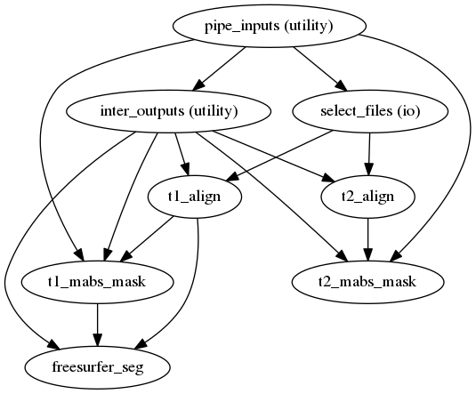
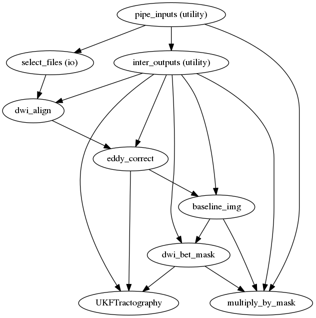
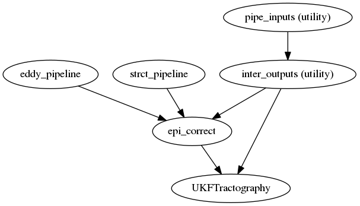
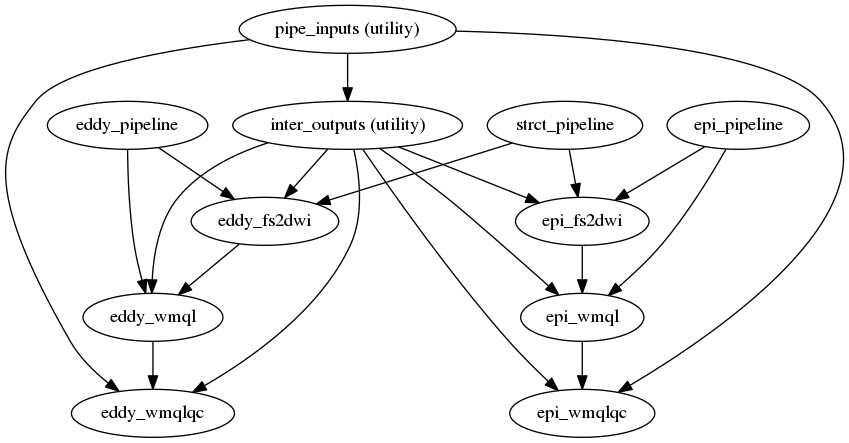

Table of Contents
=================

   * [Workflow using nipype](#workflow-using-nipype)
      * [Structural pipeline](#structural-pipeline)
      * [Eddy pipeline](#eddy-pipeline)
      * [Epi pipeline](#epi-pipeline)
      * [Tractography pipeline](#tractography-pipeline)
   * [BIDS data directory](#bids-data-directory)
   * [nipype working directory](#nipype-working-directory)

Table of Contents created by [gh-md-toc](https://github.com/ekalinin/github-markdown-toc)


# Workflow using nipype

## Structural pipeline



## Eddy pipeline



## Epi pipeline



## Tractography pipeline



# BIDS data directory

> tree * -L 6 INTRuST_BIDS

```
caselist.txt
derivatives
└── pnlNipype
    └── sub-003GNX007
        ├── anat
        │   ├── freesurfer
        │   │   ├── label
        │   │   ├── mri
        │   │   ├── scripts
        │   │   ├── stats
        │   │   ├── surf
        │   │   ├── tmp
        │   │   ├── touch
        │   │   └── trash
        │   ├── sub-003GNX007_desc-T1wXcMabs_mask.nii.gz
        │   ├── sub-003GNX007_desc-T2wXcMabs_mask.nii.gz
        │   ├── sub-003GNX007_desc-Xc_T1w.nii.gz
        │   └── sub-003GNX007_desc-Xc_T2w.nii.gz
        ├── dwi
        │   ├── sub-003GNX007_desc-dwiXcEd_bse.nii.gz
        │   ├── sub-003GNX007_desc-dwiXcEdMa_bse.nii.gz
        │   ├── sub-003GNX007_desc-XcBseBet_mask.nii.gz
        │   ├── sub-003GNX007_desc-Xc_dwi.bval
        │   ├── sub-003GNX007_desc-Xc_dwi.bvec
        │   ├── sub-003GNX007_desc-Xc_dwi.nii.gz
        │   ├── sub-003GNX007_desc-XcEd_dwi.bval
        │   ├── sub-003GNX007_desc-XcEd_dwi.bvec
        │   ├── sub-003GNX007_desc-XcEd_dwi.nii.gz
        │   ├── sub-003GNX007_desc-XcEd_dwi_xfms.tgz
        │   ├── sub-003GNX007_desc-XcEdEp_dwi_bse.nii.gz
        │   ├── sub-003GNX007_desc-XcEdEp_dwi.bval
        │   ├── sub-003GNX007_desc-XcEdEp_dwi.bvec
        │   ├── sub-003GNX007_desc-XcEdEp_dwi_mask.nii.gz
        │   └── sub-003GNX007_desc-XcEdEp_dwi.nii.gz
        ├── fs2dwi
        │   ├── eddy_fs2dwi
        │   │   ├── b0maskedbrain.nii.gz
        │   │   ├── b0masked.nii.gz
        │   │   ├── wmparcInBrain.nii.gz
        │   │   └── wmparcInDwi.nii.gz
        │   └── epi_fs2dwi
        │       ├── b0maskedbrain.nii.gz
        │       ├── b0masked.nii.gz
        │       ├── wmparcInBrain.nii.gz
        │       └── wmparcInDwi.nii.gz
        └── tracts
            ├── sub-003GNX007_desc-XcEdEp.vtk
            ├── sub-003GNX007_desc-XcEd.vtk
            ├── wmql
            │   ├── eddy
            │   └── epi
            └── wmqlqc
                ├── eddy
                └── epi
sub-003GNX007
├── anat
│   ├── sub-003GNX007_T1w.nii.gz
│   └── sub-003GNX007_T2w.nii.gz
└── dwi
    ├── sub-003GNX007_dwi.bval
    ├── sub-003GNX007_dwi.bvec
    └── sub-003GNX007_dwi.nii.gz
sub-003GNX012
├── anat
│   ├── sub-003GNX012_T1w.nii.gz
│   └── sub-003GNX012_T2w.nii.gz
└── dwi
    ├── sub-003GNX012_dwi.bval
    ├── sub-003GNX012_dwi.bvec
    └── sub-003GNX012_dwi.nii.gz
sub-003GNX021
├── anat
│   ├── sub-003GNX021_T1w.nii.gz
│   └── sub-003GNX021_T2w.nii.gz
└── dwi
    ├── sub-003GNX021_dwi.bval
    ├── sub-003GNX021_dwi.bvec
    └── sub-003GNX021_dwi.nii.gz


```


# nipype working directory

> tree dwi_pipeline/ -I "*dot|*rst|*pklz|*json|*txt|*_orig*|*_detailed*"

```
dwi_pipeline/
├── eddy_pipeline
│   ├── d3.js
│   ├── eddy_pipeline_flat.png
│   ├── index.html
│   └── _subject_id_003GNX007
│       ├── baseline_img
│       │   └── _report
│       ├── dwi_align
│       │   └── _report
│       ├── dwi_bet_mask
│       │   └── _report
│       ├── eddy_correct
│       │   └── _report
│       ├── multiply_by_mask
│       │   └── _report
│       └── UKFTractography
│           └── _report
├── epi_pipeline
│   ├── d3.js
│   ├── eddy_pipeline
│   │   └── _subject_id_003GNX007
│   │       ├── baseline_img
│   │       │   └── _report
│   │       ├── dwi_align
│   │       │   └── _report
│   │       ├── dwi_bet_mask
│   │       │   └── _report
│   │       ├── eddy_correct
│   │       │   └── _report
│   │       ├── multiply_by_mask
│   │       │   └── _report
│   │       └── UKFTractography
│   │           └── _report
│   ├── epi_pipeline
│   │   └── strct_pipeline
│   │       └── _subject_id_003GNX007
│   │           ├── inter_outputs
│   │           │   └── _report
│   │           └── select_files
│   │               └── _report
│   ├── epi_pipeline_flat.png
│   ├── index.html
│   ├── strct_pipeline
│   │   └── _subject_id_003GNX007
│   │       ├── freesurfer_seg
│   │       │   └── _report
│   │       ├── t1_align
│   │       │   └── _report
│   │       ├── t1_mabs_mask
│   │       │   └── _report
│   │       ├── t2_align
│   │       │   └── _report
│   │       └── t2_mabs_mask
│   │           └── _report
│   └── _subject_id_003GNX007
│       ├── epi_correct
│       │   └── _report
│       └── UKFTractography
│           └── _report
├── fs2dwi_pipeline
│   ├── d3.js
│   ├── epi_pipeline
│   │   ├── strct_pipeline
│   │   │   └── _subject_id_003GNX007
│   │   │       ├── freesurfer_seg
│   │   │       │   └── _report
│   │   │       ├── t1_align
│   │   │       │   └── _report
│   │   │       ├── t1_mabs_mask
│   │   │       │   └── _report
│   │   │       ├── t2_align
│   │   │       │   └── _report
│   │   │       └── t2_mabs_mask
│   │   │           └── _report
│   │   └── _subject_id_003GNX007
│   │       ├── epi_correct
│   │       │   └── _report
│   │       └── UKFTractography
│   │           └── _report
│   ├── fs2dwi_pipeline
│   │   └── epi_pipeline
│   │       ├── eddy_pipeline
│   │       │   └── _subject_id_003GNX007
│   │       │       ├── baseline_img
│   │       │       │   └── _report
│   │       │       ├── dwi_align
│   │       │       │   └── _report
│   │       │       ├── dwi_bet_mask
│   │       │       │   └── _report
│   │       │       ├── eddy_correct
│   │       │       │   └── _report
│   │       │       ├── multiply_by_mask
│   │       │       │   └── _report
│   │       │       └── UKFTractography
│   │       │           └── _report
│   │       └── epi_pipeline
│   │           └── strct_pipeline
│   │               └── _subject_id_003GNX007
│   │                   ├── inter_outputs
│   │                   │   └── _report
│   │                   └── select_files
│   │                       └── _report
│   ├── fs2dwi_pipeline_flat.png
│   ├── index.html
│   └── _subject_id_003GNX007
│       ├── eddy_fs2dwi
│       │   └── _report
│       ├── eddy_wmql
│       │   └── _report
│       ├── eddy_wmqlqc
│       │   └── _report
│       ├── epi_fs2dwi
│       │   └── _report
│       ├── epi_wmql
│       │   └── _report
│       └── epi_wmqlqc
│           └── _report
└── strct_pipeline
    ├── d3.js
    ├── index.html
    ├── strct_pipeline_flat.png
    └── _subject_id_003GNX007
        ├── freesurfer_seg
        │   └── _report
        ├── inter_outputs
        │   └── _report
        ├── select_files
        │   └── _report
        ├── t1_align
        │   └── _report
        ├── t1_mabs_mask
        │   └── _report
        ├── t2_align
        │   └── _report
        └── t2_mabs_mask
            └── _report


```

